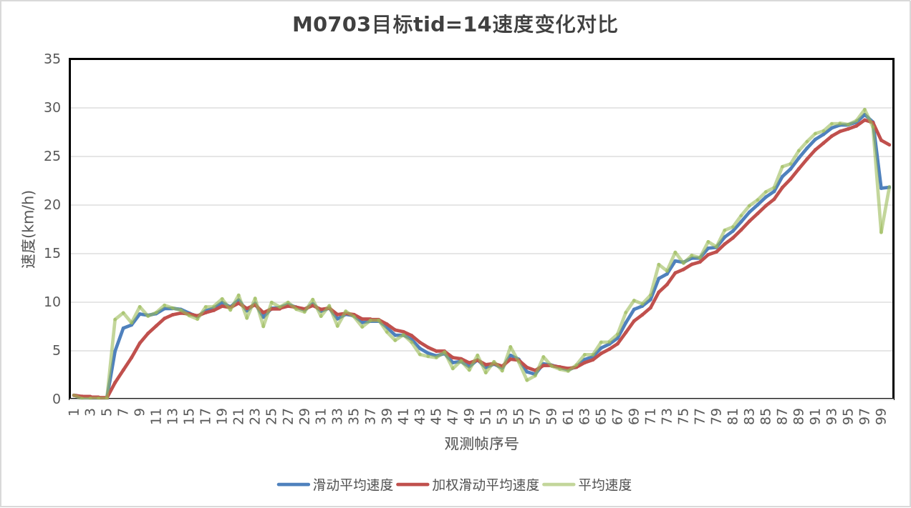
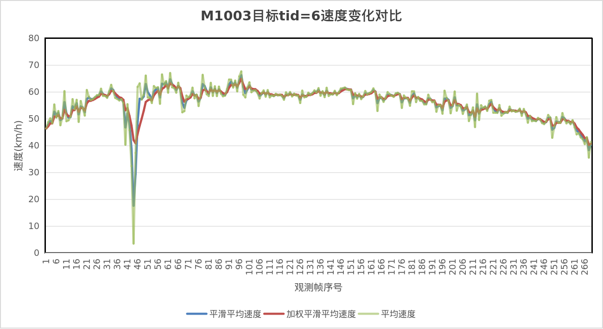

## 2025-12-23 — Confidence-Weighted Speed Smoothing for UAV-Based Speed Estimation

### 1. Background and Motivation

In the initial implementation of the UAV speed estimation module, the displayed
speed was computed from two consecutive observations by measuring the spatial
displacement and dividing it by the corresponding temporal interval. Although
this formulation provides high responsiveness, it is extremely sensitive to
detection noise, bounding-box jitter, homography instability, and partial target
truncation near image borders. Consequently, the instantaneous speed signal
exhibits strong frame-to-frame fluctuations, which significantly degrades both
visual stability and physical interpretability.

To mitigate this issue, a fixed exponential moving average (EMA) was introduced.
The smoothed speed at frame \(k\) was defined as

$$
V_{\mathrm{smooth}}^{(k)}=
\alpha \, V_{\mathrm{raw}}^{(k)}
+
(1-\alpha)\, V_{\mathrm{smooth}}^{(k-1)},
\quad \alpha = 0.6 .
$$

While this approach improves temporal smoothness, the fixed coefficient
implicitly assumes uniform reliability of all instantaneous speed measurements.
In real-world UAV scenarios, however, the confidence of a given observation
varies significantly with detection quality, geometric stability, spatial
location, and dynamic consistency. A constant smoothing factor is therefore
insufficient under complex operating conditions.

---

### 2. Confidence-Weighted Exponential Moving Average

To address this limitation, the fixed smoothing coefficient is replaced by a
dynamic confidence weight \(W_k \in [0,1]\), yielding the following adaptive
update rule:

$$
V_{\mathrm{smooth}}^{(k)}=
W_k \, V_{\mathrm{raw}}^{(k)}
+
(1 - W_k)\, V_{\mathrm{smooth}}^{(k-1)} .
$$

Here, the contribution of the current speed measurement is modulated by its
estimated confidence. High-confidence observations lead to larger values of
\(W_k\), allowing rapid adaptation, whereas low-confidence observations suppress
the influence of the current measurement in favor of historical estimates.

---

### 3. Composite Confidence Weight Formulation

The instantaneous confidence weight is defined as the product of several
independent sub-weights, each characterizing a distinct source of uncertainty:

$$
W_{\mathrm{raw}}=
w_{\mathrm{bbox}}
\cdot
w_{\mathrm{homo}}
\cdot
w_{\Delta v}
\cdot
w_{\mathrm{edge}} .
$$

This multiplicative structure ensures that a significant degradation in any
single factor is sufficient to reduce the overall confidence assigned to the
current speed estimate.

To avoid abrupt changes in responsiveness, the confidence weight itself may be
temporally smoothed:

$$
W_k=
\eta_w \, W_{\mathrm{raw}}
+
(1 - \eta_w)\, W_{k-1} .
$$

---

### 4. Bounding-Box Consistency Weight

Let the characteristic scale of the detected bounding box at frame \(k\) be
defined as

$$
s_k = \sqrt{w_k \, h_k},
$$

where \(w_k\) and \(h_k\) denote the width and height of the bounding box,
respectively. A reference scale is maintained via an exponential moving average:

$$
s_{\mathrm{ref}}^{(k)}=\rho_{\mathrm{size}} \, s_k
+
(1 - \rho_{\mathrm{size}})\, s_{\mathrm{ref}}^{(k-1)} .
$$

The relative scale deviation is then computed as

$$
\delta_s=
\frac{\lvert s_k - s_{\mathrm{ref}}^{(k)} \rvert}
{s_{\mathrm{ref}}^{(k)} + \varepsilon} .
$$

This deviation is mapped to a confidence weight using a Gaussian decay function:

$$
w_{\mathrm{bbox}}=
\max
\left(
w_{\min,\mathrm{bbox}},
\;
\exp
\left(
-\frac{\delta_s^2}{2\sigma_{\mathrm{bbox}}^2}
\right)
\right) .
$$

This term penalizes abrupt changes in bounding-box scale, which commonly arise
from occlusion, detector instability, or misassociation.

---

### 5. Homography Quality Weight

Let \(r\) denote the inlier ratio and \(N\) the inlier count obtained during
homography estimation. These quantities are normalized as

$$
r_n=
\mathrm{clip}
\left(
\frac{r - r_0}{1 - r_0},
\, 0, \, 1
\right),
\qquad
N_n=
\mathrm{clip}
\left(
\frac{N}{N_0},
\, 0, \, 1
\right).
$$

The homography confidence weight is then defined as

$$
w_{\mathrm{homo}}=
w_{\min,\mathrm{h}}
+
(1 - w_{\min,\mathrm{h}})\, r_n \, N_n .
$$

This term reflects the reliability of the geometric mapping used to convert
image-space displacements into real-world distances.

---

### 6. Image Border Proximity Weight

Let \((x, y)\) denote the target center in image coordinates, and let the image
resolution be \(W \times H\). The minimum distance from the target center to the
image boundary is defined as

$$
d = \min(x, y, W - x, H - y) .
$$

A border band width is specified as

$$
d_0 = \mathrm{edge\_ratio} \cdot \min(W, H) .
$$

The corresponding confidence weight is defined as

$$
w_{\mathrm{edge}}=
\begin{cases}
w_{\min,\mathrm{edge}}
+
\left(1 - w_{\min,\mathrm{edge}}\right)\dfrac{d}{d_0},
& d < d_0, \\[6pt]
1,
& d \ge d_0 .
\end{cases}
$$

This formulation reduces the influence of speed estimates obtained when the
target is close to the image boundary, where truncation and localization errors
are more likely to occur.

---

### 7. Speed Jump Gating Weight

To suppress abnormal speed spikes, an adaptive upper bound on permissible speed
variation is introduced:

$$
\Delta V_{\max}=
d v_a
+
d v_b \cdot V_{\mathrm{smooth}} .
$$

The normalized speed jump magnitude is defined as

$$
x=
\frac{\lvert \Delta V \rvert}
{\Delta V_{\max} + \varepsilon} .
$$

A soft gating function is then applied:

$$
w_{\Delta v}=
\max
\left(
w_{\min,\Delta v},
\;
\frac{1}{1 + x^p}
\right) .
$$

This mechanism limits the impact of physically implausible speed variations while
preserving responsiveness under normal motion patterns.

---

### 8. Discussion

The proposed confidence-weighted exponential moving average incorporates multiple factors related to the reliability of speed estimation into a unified adaptive smoothing framework. Compared with the fixed-coefficient EMA method, this approach maintains good responsiveness under high-confidence conditions, while exhibiting stronger robustness in the presence of detection noise, geometric instability, image border effects, and abnormal speed variations. The resulting speed estimates are temporally smoother, physically more reasonable, and more interpretable, making the method suitable for practical UAV-based monitoring and traffic analysis scenarios.

The method was evaluated on representative target trajectories from two real UAV video sequences **M0703** and **M1003**, where speed profiles obtained from raw measurements, fixed-coefficient EMA, and confidence-weighted EMA were compared. The experimental results show that, across different speed ranges and motion patterns, the confidence-weighted EMA effectively suppresses local anomalous fluctuations while preserving the overall speed evolution trend, demonstrating its stability and practical effectiveness in complex real-world conditions.

From an implementation perspective, the method is fully managed through a configuration file. Users can flexibly enable or disable confidence-weighted smoothing, adjust relevant weighting and threshold parameters, and optionally export diagnostic speed and weight statistics for analysis and evaluation via `speed_config.yaml`, allowing a controlled trade-off between stability, responsiveness, and analysis requirements.