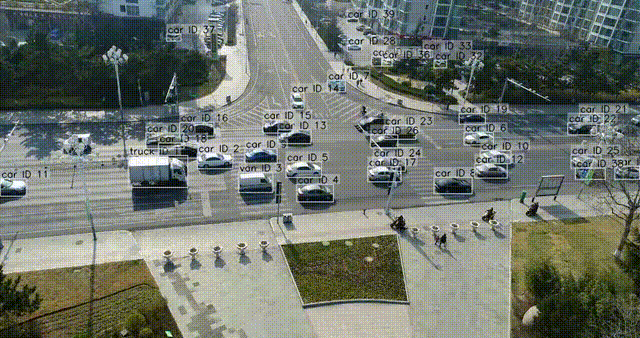

# UAV-Speed：基于YOLO目标跟踪以及特征匹配的单目无人机车辆测速算法

[🇨🇳 中文说明](README_ch.md) ｜ [🇬🇧 English README](README.md)

> 基于 YOLOv11 + BoT-SORT + 单应性（Homography）相机运动补偿的  
> **无人机斜视场景车辆速度估计流水线**。

---

## 🎬 演示示例（UAV 车辆测速）

<p align="center">
  
  
  
</p>

本仓库提供一条 **可以直接用于实际巡检** 的端到端流水线，从 **单目 UAV 视频** 中估计车辆速度。  
主要面向 **日常巡检飞行** 场景（中低空、斜视角度），典型特点包括：

- 无人机在运动，存在明显的 **相机自运动（ego-motion）**；
- 车辆既可能完全静止，也可能低速缓慢行驶；
- 希望获得：
  - **鲁棒的“静止 vs 运动”分类**；
  - **稳定、不过度抖动的速度显示**。

---

## 更新记录

### 2025-12-23 — 基于置信度加权的速度平滑方法

本次更新引入了一种基于置信度加权的指数滑动平均方法，用于提升无人机测速在复杂观测条件下的稳定性与可解释性。

- 📄 **English documentation**: [README_Weight.md](README_Weight.md)
- 📄 **中文说明文档**： [README_Weight_ch.md](README_Weight_ch.md)

该更新通过配置文件提供统一管理方式，支持灵活启用或关闭加权平滑策略、调整与可靠性相关的参数，并可选择性导出用于分析与评估的诊断结果，同时保持对原有固定系数 EMA 流程的兼容性。


## ✨ 主要特性（Key Features）

- **目标检测（YOLOv11）**  
  使用 YOLOv11 进行车辆 / 行人等目标检测，适配 UAV / VisDrone 风格数据。

- **多目标跟踪（BoT-SORT）**  
  使用 BoT-SORT 为每个目标分配稳定的 track ID，支持多目标长时间跟踪。

- **相机运动补偿（Homography）**  
  将运动目标框作为mask剔除，仅在背景上提取特征点，估计帧间单应性矩阵，  
  将相机运动从整体位移中“扣除”，只保留目标相对地面的运动。

- **静止 vs 运动 判定（状态机）**
  - **几何证据**：基于相机补偿后的轨迹位移；
  - **光度证据**：在局部区域计算亮度残差；
  - 使用 **迟滞 (hysteresis)** 机制，避免静止/运动状态频繁抖动。

- **速度估计（km/h）**
  - 通过 “像素——米” 比例，将像素位移转换为真实距离；
  - 比例可基于车辆典型长度、场景先验等设定；
  - 仅对 **被判定为运动的车辆** 显示速度。

- **即开即用脚本**
  - 一条命令即可对自己的 UAV 视频跑完整流程；
  - 自动生成带速度 & 状态标注的演示视频，方便汇报 / Demo。

---

## 🧩 流水线整体流程（Pipeline Overview）

流水线的核心步骤如下：

1. **目标检测（YOLOv11）**  
   - 输入：原始 UAV 图像帧  
   - 输出：目标框 + 类别分数

2. **多目标跟踪（BoT-SORT）**  
   - 输入：当前帧检测结果 + 历史轨迹  
   - 输出：每个目标的稳定 track ID

3. **相机运动估计（Homography）**  
   - 在相邻帧间，从背景区域提取特征点并匹配；  
   - 估计帧间单应性矩阵，得到相机运动；  
   - 用该矩阵对轨迹进行补偿，得到目标 **相对地面的运动**。

4. **静止 vs 运动 决策**
   - 对每条轨迹，在时间窗口内累积补偿后的位移；  
   - 融合几何位移 + 亮度残差两种证据；  
   - 使用带迟滞的状态机，输出稳定的 `static` / `moving` 状态。

5. **速度估计（Speed Estimation）**
   - 基于场景配置得到 meters-per-pixel（例如用车辆典型长度近似）；  
   - 将像素位移转换为米，再根据时间间隔得到 km/h；  
   - 仅对 `moving` 车辆显示速度，静止车辆只标状态。

6. **可视化与导出（Visualization）**
   - 在每帧图像上绘制：
     - 目标框
     - track ID
     - 静止 / 运动 状态
     - （可选）速度数值（km/h）
   - 将结果编码为输出视频，保存在 `data/output/` 下。

---

## 📁 仓库结构（Repository Structure）

下面是一个推荐的项目结构（可以根据自己实际情况调整）：

```text
speed-detection/
  ├─ configs/
  │   ├─ trackers/
  │   │   ├─ botsort.yaml          # BoT-SORT 跟踪器配置
  │   │   └─ bytetrack.yaml        # （可选）ByteTrack 配置
  │   └─ speed_config.yaml         # 速度估计 & 静止/运动判定配置
  │
  ├─ data/
  │   ├─ videos/                   # 输入 UAV 视频（用户自备）
  │   ├─ output/                   # 输出的测速结果视频
  │   │   ├─ demo_M0703.mp4
  │   │   ├─ demo_M1003.mp4
  │   │   └─ demo_M1303.mp4
  │   └─ visdrone_frames/          # （可选）VisDrone 原始帧 / 示例数据
  │
  ├─ scripts/
  │   ├─ run_speed.py              # 主入口：对单个视频跑完整测速流程
  │   ├─ run_yolo_detect_video.py  # 仅做 YOLO 检测 / 跟踪可视化
  │   └─ frames_to_video.py        # 工具：图片帧序列转视频
  │
  ├─ src/
  │   ├─ config/
  │   │   └─ loader.py             # 配置加载 & 动态类别辅助函数
  │   ├─ io/
  │   │   └─ frame_source.py       # 视频 / 帧序列统一读取接口
  │   ├─ motion/
  │   │   ├─ homography.py         # 相机运动估计（ORB + RANSAC）
  │   │   ├─ speed_estimator.py    # 速度估计相关工具（mpp、平滑等）
  │   │   └─ state_machine.py      # 静止 / 运动 状态机逻辑
  │   ├─ pipeline/
  │   │   └─ speed_pipeline.py     # 高层流水线封装
  │   └─ vis/
  │       └─ draw.py               # 画框、标签、速度叠加等
  │
  ├─ weights/
  │   ├─ yolo11-visdrone.pt        # 在 UAV / VisDrone 上微调的 YOLOv11 权重
  │   └─ yolo11.pt                 # （可选）通用 YOLOv11 权重
  │
  ├─ README.md                     # 英文版 README
  ├─ README_ch.md                  # 中文版 README（本文件）
  └─ requirements.txt
```

---

## ⚙️ 环境与安装（Environment & Installation）

整体设计尽量保持 **简单 & 可复现**。  
**只要你能正常运行 Ultralytics YOLO，一般就能跑通本仓库。**

### Python & 操作系统

- Python **3.8+**（已在 3.8–3.11 测试）
- 支持 Python 的常见系统：
  - Linux
  - Windows
  - macOS

GPU **不是硬性要求**：

- 有 NVIDIA GPU + CUDA → 推理速度更快；
- 只有 CPU 也能跑，只是速度相对偏慢。

### 推荐环境（Conda 示例）

推荐使用虚拟环境（如 conda），例如：

```bash
conda create -n uav-speed python=3.10 -y
conda activate uav-speed
pip install -r requirements.txt
```
## 🚀 快速上手（Quick Start）

本项目的单目 UAV 车辆测速流水线基于：

- **YOLOv11**：目标检测  
- **BoT-SORT**：多目标跟踪  
- **Homography**：相机运动补偿  

同时提供一个在 **UAV / VisDrone 风格数据** 上微调过的 YOLO 模型，例如：

- `weights/yolo11l-visdrone.pt`

你可以直接使用该权重，也可以替换为自己的 YOLO checkpoint。  
**非常重要：** 在估计 Homography 时，需要把所有“动态目标”从特征匹配中剔除，  
因此必须在配置文件中明确：

- 哪些类别视为“动态”（`dynamic_classes.names`）；
- 各类别的大致物理长度（`speed.class_length_m`）。

---

### 1. 使用内置模型跑自己的 UAV 视频

1. 将 UAV 视频放到 `data/videos/` 目录：

   ```text
   data/videos/my_uav_video.mp4
   ```

2. 确认 configs/speed_config.yaml 中的关键配置

   - `video_path`：输入视频路径；
   - `output_path`：输出视频路径；
   - `yolo_weights`：YOLOv11 权重路径；
   - `dynamic_classes.names`：动态目标类别；
    **模型权重：**
    ```text
    model:
      weights: "weights/yolo11l-visdrone.pt"

    ```
    **动态类别列表：**
    ```text
    dynamic_classes:
      names:
      - car
      - truck
      - bus
      ids: []  # 可选：如果你想用数值 ID，也可以在这里填
    ```
    这些类别在估计 Homography 时会被 mask 掉，只用背景点来估计相机运动。
    **各类的大致物理长度（米）：**
    ```text
    speed:
      default_length_m: 5.0

      class_length_m:
        car:   4.5
        truck: 9.0
        bus:   11.0
    ```
3. 运行脚本：

   ```bash
   PYTHONPATH=. python scripts/run_speed.py \
    --video data/videos/my_uav_video.mp4 \
    --config configs/speed_config.yaml \
    --out data/output/my_uav_video_speed.mp4
   ```
**输出视频中会包含**
- 对被判定为静止的车辆，显示 `STATIC`（可根据需要在代码中改成中文等）；
- 对被判定为运动的车辆，显示 `xx.x km/h`；
- 所有速度均基于 **相机运动补偿后的运动结果**。

---

### 2. 替换为你自己的 YOLO 模型

你可以用任何 Ultralytics 支持的 YOLOv8 / YOLOv11 风格模型替换默认权重，只需：

- 把权重文件放到 `weights/` 目录；
- 正确配置动态类别和类别长度。

**示例：放入你的权重**

```text
weights/my_yolo_model.pt
```

**示例：配置文件中指定权重和动态类别**
在 `configs/speed_config.yaml` 中指定该权重和动态类别，例如：

```yaml
model:
  weights: "weights/my_yolo_model.pt"

dynamic_classes:
  names:
    - car
    - truck
    - bus
    # 也可以加入你自己的运动目标，例如：
    # - motorcycle
    # - bicycle
  ids: []   # 可选：如果你更习惯用类别 ID，可以在这里写

speed:
  default_length_m: 5.0

  class_length_m:
    car:   4.5
    truck: 9.0
    bus:   11.0
```
**同样使用 run_speed.py 运行：**
```text
PYTHONPATH=. python scripts/run_speed.py \
  --video data/videos/my_uav_video.mp4 \
  --config configs/speed_config.yaml \
  --out data/output/my_uav_video_speed.mp4
```
### 3. 可选：调静止 / 运动阈值 & 稳定性

你可以在配置文件中进一步调节静止 / 运动判定的阈值与稳定性，例如：

```text
static_detection:
  d_static_px: 2.5    # 像素位移小于该值 → 倾向判定为静止
  d_moving_px: 5.0    # 像素位移大于该值 → 倾向判定为运动

  r_static_mean: 12.0 # 亮度残差小于该值 → 静止证据更强
  r_moving_mean: 25.0 # 亮度残差大于该值 → 运动证据更强

  k_static: 6         # 连续多少帧符合“静止”条件才确认静止
  k_moving: 2         # 连续多少帧符合“运动”条件才确认运动
```
经验上的调参方向：

- 想让“静止”判定更严格 → 减小 `d_static_px` / `r_static_mean`；
- 想让“运动”判定更有把握 → 增大 `d_moving_px` / `r_moving_mean`；
- 想让状态更稳定、减少抖动 → 增大 `k_static` / `k_moving`。

---

## 🙏 致谢（Acknowledgements）

本项目基于社区中大量优秀的开源工作与数据集，在此表示感谢：

- **Ultralytics YOLO11**  
  检测与跟踪部分基于 Ultralytics YOLO 生态完成。

- **YOLO11l VisDrone 权重**  
  默认的 UAV / 斜视场景检测模型来自  
  `erbayat/yolov11l-visdrone`。

- **VisDrone 数据集**  
  UAV 检测与跟踪任务的重要基准数据集：  
  P. Zhu *et al.*, “Vision Meets Drones: A Challenge,” ECCV Workshops, 2018.  
  Dataset: <https://github.com/VisDrone/VisDrone-Dataset>

- **UAV Benchmark (UAVDT)**  
  UAV 场景下目标检测与跟踪的重要基准数据集：  
  D. Du *et al.*, “The Unmanned Aerial Vehicle Benchmark: Object Detection and Tracking,” ECCV 2018.  
  Benchmark: <https://sites.google.com/view/grli-uavdt/>

如果你在研究或项目中使用了本仓库的代码或配置，请同时遵守上述模型与数据集的许可证 / 使用条款，并在合适的位置进行引用。

---

## ✅ TODO / 后续计划（Future Work）

当前版本更偏向“工程可用”的第一版，后续计划包括但不限于：

- **与相机参数更紧耦合的阈值与速度缩放**  
  目前静止 / 运动阈值主要基于经验调参。  
  后续可引入相机内参（焦距、视场角）与 UAV 大致高度，  
  自适应调整像素位移阈值与速度估计精度。

- **更强的特征提取与匹配模块**  
  当前使用 ORB + BFMatcher 进行背景特征匹配；  
  后续可以尝试 SIFT 或学习型特征，以及更鲁棒的匹配策略，  
  提升相机运动估计在纹理弱 / 光照变化场景下的稳定性。

- **更几何一致的尺度估计方案**  
  目前主要通过“每类一个典型长度 + bbox 长边”来估算 meters-per-pixel；  
  后续考虑引入车辆姿态、道路方向、视角几何等信息，  
  对单个轨迹动态更新更精确的尺度，而不是只依赖单一的固定长度先验。

---

